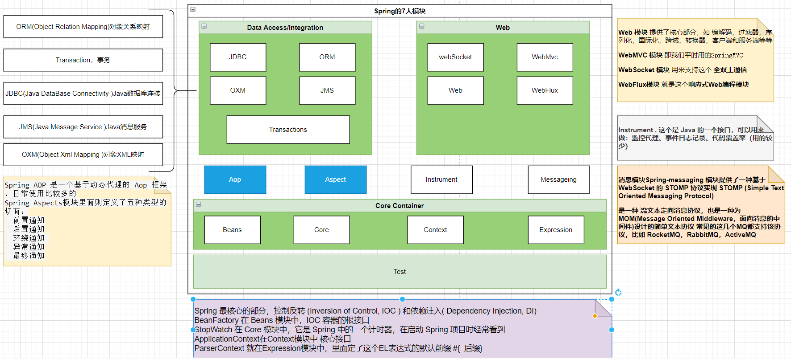

# Spring学习笔记

::: tip

 在markdown代码中，您将看到注释，注释前面的代码将显示在列表页面上的文章摘要中。 

:::

::: danger

这个danger摘要

可以换行展示

:::

::: warning
This is a warning
:::


::: theorem 牛顿第一定律
假若施加于某物体的外力为零，则该物体的运动速度不变。

::: right
来自 [维基百科](https://zh.wikipedia.org/wiki/%E7%89%9B%E9%A1%BF%E8%BF%90%E5%8A%A8%E5%AE%9A%E5%BE%8B)
:::

::: details
这是一个详情块，在 IE / Edge 中不生效
:::


### 定义流程图

@flowstart
cond=>condition: Process?
process=>operation: Process
e=>end: End

cond(yes)->process->e
cond(no)->e
@flowend


## 概述

### Spring优点

1、Spring是一个开源免费的框架 （容器 ）

2、Spring是一个轻量级的框架 , 非侵入式的

3、控制反转 IOC

4、面向切面 Aop

5、对事物的支持 , 对其他框架的支持

...

一句话概括：

**Spring是一个轻量级的控制反转(IoC)和面向切面(AOP)的容器（框架）**

### Spring体系结构



Spring 由 20 多个模块组成，它们可以分为：数据访问/集成（Data Access/Integration）、Web、面向切面编程（AOP, Aspects）、提供 JVM的代理（Instrumentation）、消息发送（Messaging）、核心容器（Core Container）和测试（Test）。

## IOC

### 1、理解容器

控制反转（IOC，Inversion of Control），是一个概念，是一种思想。指将传统上由程序代码直接操控的对象调用权交给容器，通过容器来实现对象的装配和管理。控制反转就是对对象控制权的转移，从程序代码本身反转到了外部容器。通过容器实现对象的创建，属性赋值，依赖的管理。 IoC 是一个概念，是一种思想，其实现方式多种多样。当前比较流行 应用广泛的实现方式是依赖注入。

**依赖：**classA 类中含有 classB 的实例，在 classA 中调用 classB 的方法完成功能，即 classA对 classB 有依赖。 

**Ioc 的实现：** 

➢ 依赖注入：DI(Dependency Injection)，程序代码不做定位查询，这些工作由容器自行完成。 

依赖注入 DI 是指程序运行过程中，若需要调用另一个对象协助时，无须在代码中创建被调用者，而是依赖于外部容器，由外部容器创建后传递给程序。 

Spring 的依赖注入对调用者与被调用者几乎没有任何要求，完全支持对象之间依赖关系的管理。 

Spring 框架使用依赖注入（DI）实现 IoC。 

Spring 容器是一个超级大工厂，负责创建、管理所有的 Java 对象，这些 Java 对象被称为 Bean。Spring 容器管理着容器中 Bean 之间的依赖关系，Spring 使用“依赖注入”的方式来管理 Bean 之间的依赖关系。使用 IoC 实现对象之间的解耦和。

```java
public interface SomeService { 
    void doSome(); 
} 

public class SomeServiceImpl implements SomeService { 
    public SomeServiceImpl() { 
        super(); 
        System.out.println("SomeServiceImpl无参数构造方法"); 
    } 
    @Override 
    public void doSome() { 
        System.out.println("====业务方法doSome()==="); 
    } 
}
```

## AOP
## Spring集成Mybatis
## Spring集成Elasticsearch